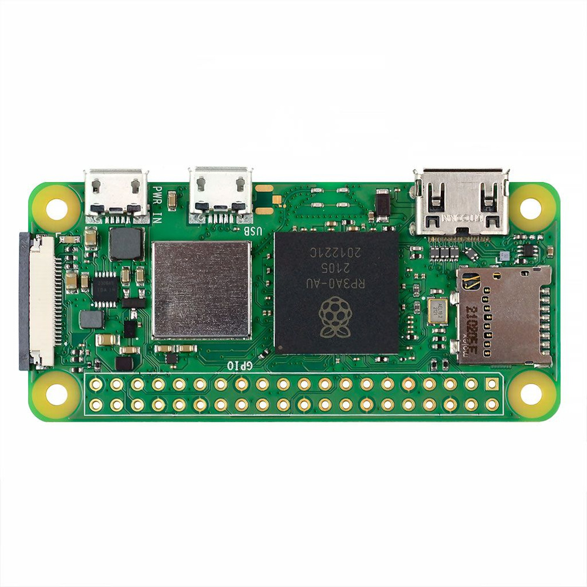
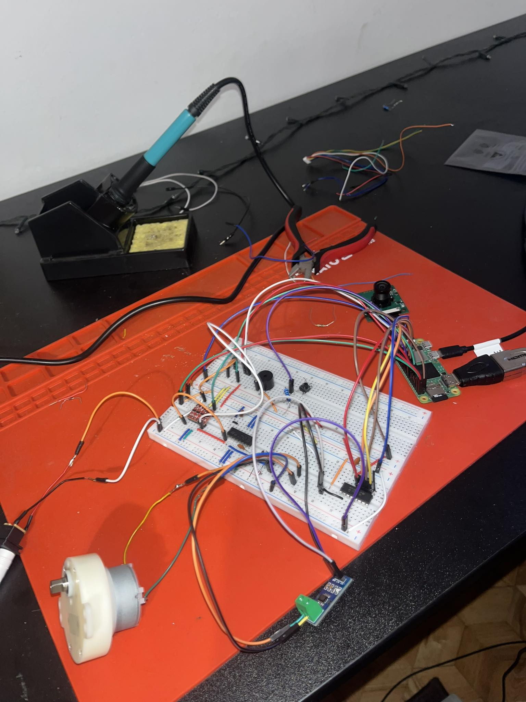

<h1>AI cat feeder.</h1>

 This project aimed to create a cat feeder, which will detect a certain cat, and feed it. The detector will detect different cats, and give a feed in dependence of how much the cat has eaten per day or week. Also, this feeder can save and analyze the statistics of how much each cat has eaten for all periods of work. The data is being displayed, and the device is being controlled through the phone.

<h2>Electronics</h2>

The new electronics was designed as a shield for the Raspberry Pi Zero W 2.
The board consists of:

<table>
  <tr>
    <th>Raspberry Pi Zero W 2</th>
  </tr>
  <tr>
    <td></td>
  </tr>
</table>
<ul>
  <li>MCP3008 - 8 channel SPI ADC (Raspberry Pi Zero does not have its own)</li>
  <li>L293B - a DC motor controller (This is quite old-fashioned circuit, but we had only those in University, so, we have what we have :) )</li>
  <li>ACS712 - Analog current sensor</li>
  <li>BSS138 - MOSFETs, that are used for voltage level conversion (The motor control module works on 5V logic, and the Raspberry's logic is 3.3V)</li>
</ul>

The circuit outputs are:

<ul>
  <li>Button output - this is the output for the motor button (it is used to detect the motor rotation angle)</li>
  <li>Weight output - this is the output to be used for a weight sensor, to measure the weight of feed inside the bowl</li>
  <li>Motor output - The output is used to connect the motor</li>
  <li>5V output - If we want to implement something in the future, this port will be used (just additional power output)</li>
</ul>

The circuitry of the project is drawn here:

<table>
  <tr>
    <th>The PCB Gerber file</th>
    <th>The PCB 2D view</th>
    <th>The PCB 3D view</tr>
  </tr>
  <tr>
    <td></td>
    <td></td>
    <td></td>
  </tr>
</table>

The PCB circuit has SMD and THD components. The components will be soldered using the reflow technique, but THD components will be soldered with the solderer. The power lines have bigger size (twice as big as signal lines). The big copper bottom-layer is circuit ground, and big copper layer on the top-layer is VCC. The vcc is taken from Raspberry's Vbus pin, as soon as is goes directly from USB feeding, without any influence.

<h2>The prototype circuit:</h2>
<table>
  <tr>
    <th></th>
    <th></th>
  </tr>
</table>

<h2>Mechanical part</h2>

For this project, in the purpose of concentrating more on the circuit, it was decided to buy an existing automated cat feeder and replace the insides with our own.

The cat feeder we used:

The feeding mechanism works in the way, that the motor rotates till the button is released and pressed again.

The motor motion:

<h2>The AI part</h2>

